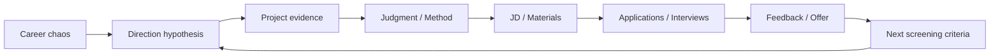

<h1 align="center">CCC — Career Cognition Compass</h1>

<p align="center">
  <a href="README.md">中文</a>
  ·
  <a href="README.en.md">English</a>
</p>

<p align="center">
  English Edition
</p>

<p align="center">
  From career chaos to evidence, judgment, and next actions.
</p>

<p align="center">
  <a href="prompts/copy-paste-prompt-lite-en.md">Try the Lite Prompt</a>
  ·
  <a href="QUICKSTART.en.md">Quickstart</a>
  ·
  <a href="DEMO.en.md">60-second Demo</a>
  ·
  <a href="DOWNLOADS.md">Downloads</a>
</p>

<p align="center">
  <a href="LICENSE"></a>
  <a href="QUICKSTART.en.md"></a>
  <a href="DOWNLOADS.md"></a>
  
  
</p>

CCC is an open-source career cognition and job-search workflow.

It helps you make sense of messy career information before turning everything into resumes, interview scripts, or applications.

Current stage: Beta · Active Development. CCC can already be used for personal job-search support, but public real-platform Smoke Report coverage is still 0, so it should not be treated as fully validated across all models or platforms.

## When CCC Is Useful

> "I keep reading job descriptions, but I still don't know which roles to target."

> "Every application feels like I need to rebuild my resume from scratch."

> "In interviews, I can describe what I did, but I struggle to explain my judgment."

> "I have applications and interviews, but no offer yet. I don't know what the signal means."

> "I keep changing my resume and strategy, but I don't know whether I'm reacting to real signals or just getting anxious."

## Core Use Cases

| When you're stuck | CCC helps you |
| --- | --- |
| You don't know which roles to target | Cluster roles into testable role families |
| Your experience sounds like tasks, not evidence | Build project evidence and Judgment Traces |
| Tailoring every application is exhausting | Use Master Resume → Role Family Resume → JD Patch |
| Interviewers keep asking "why?" | Recover judgment, trade-offs, and methodology |
| Applications and interviews go nowhere | Diagnose the funnel before changing everything |
| You have an offer but don't know how to evaluate it | Compare terms, risks, career capital, and negotiation options |

Context-aware job search: local · cross-region · cross-market · remote · relocation · second-language

## Why CCC?

| Common workflow | CCC |
| --- | --- |
| Generate first | Clarify first |
| Rewrite for every JD | Role Family + Patch |
| Treat one rejection as a verdict | Signal → Pattern → Conclusion |
| Repeat model output | Separate result from your judgment |
| Give many recommendations | One main thread + one next action |

## Career Cognition Loop

CCC is not a linear job-search funnel. It is a loop for updating your career understanding through applications, interviews, feedback, and offers.



Principle: no outcome can still leave a signal, but not every signal is strong enough to become a conclusion.

## Context-Aware Job Search

CCC is language-aware and context-aware.

The language you use with CCC does not determine your job market.

Location, target market, work authorization, relocation, remote eligibility, and local hiring conventions are only considered when they materially affect the task.

Examples:

```text
English-speaking user, based in the US, applying for US roles -> domestic context
English-speaking user, based in the US, applying for UK roles -> cross-market context
Second-language English user, applying locally -> domestic + second-language context
```

Applying across markets? Read the guide: [International / Cross-market Job Search](docs/international-job-search.md)

## What CCC Does Not Do

- It does not guarantee interviews, offers, sponsorship, or relocation.
- It does not make legal, immigration, tax, or financial decisions.
- It does not fabricate work history, education, projects, salary, references, or competing offers.
- It does not treat one rejection as a final verdict.
- It does not turn MBTI, zodiac signs, or personality labels into career decisions.

Privacy reminder: do not share passport numbers, visa document numbers, national IDs, private addresses, phone numbers, personal email, full offer letters, contracts, salary screenshots, confidential employer information, or complete interview transcripts.

## Start

| Entry | Best for | Where to start |
| --- | --- | --- |
| General LLM | quick trial, lower token use, mobile use | [English Lite Prompt](prompts/copy-paste-prompt-lite-en.md) |
| Codex / Claude Code | modular Skill workflow | [SKILLS.md](SKILLS.md) |
| WorkBuddy | mainland China accessible Agent setup; documentation is currently Chinese-first | [WorkBuddy Lite Prompt](workbuddy/system-prompt-lite.md) |

More options: [QUICKSTART.en.md](QUICKSTART.en.md)

## Examples

- [60-second Demo](DEMO.en.md)
- [International / Cross-market Job Search](examples/international-job-search.md)

Chinese-first scenario examples:

- [Full Walkthrough](examples/full-walkthrough.md)
- [Direction Confusion](examples/direction-confusion.md)
- [Interview Judgment](examples/interview-judgment.md)
- [No Outcome Loop](examples/no-outcome-loop.md)
- [Offer Decision](examples/offer-decision.md)

## Developer & Evaluation

48 behavior contracts · deterministic eval runner · public smoke testing pending

See [evals/README.md](evals/README.md), [ROADMAP.md](ROADMAP.md), and [docs/compatibility.md](docs/compatibility.md).

## License / Contributing / Support

CCC uses the [MIT License](LICENSE).

For anonymized feedback, see [FEEDBACK.md](FEEDBACK.md).

To contribute, start with [CONTRIBUTING.md](CONTRIBUTING.md), [SECURITY.md](SECURITY.md), and the GitHub issue templates.
