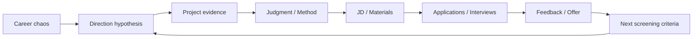

<h1 align="center">CCC — Career Cognition Compass</h1>

  <a href="README.md">中文</a>
  ·
  <a href="README.en.md">English</a>

  From career chaos to evidence, judgment, and next actions.

  <a href="prompts/copy-paste-prompt-lite-cn.md">Try the Lite Prompt</a>
  ·
  <a href="DOWNLOADS.md">Downloads</a>
  ·
  <a href="DEMO.md">60-second Demo</a>
  ·
  <a href="docs/full-guide.md">Full Guide</a>

  
  
  
  
  

CCC is an open-source career cognition and job-search workflow.

It helps you make sense of messy career information before turning everything into resumes, interview scripts, or applications.

Current stage: Beta · Active Development. CCC can already be used for personal job-search support, but public real-platform Smoke Reports are still limited, so it should not be treated as fully validated across all models or platforms.

## When CCC Is Useful

> "I keep reading job descriptions, but I still don't know which roles to target."

> "Every application feels like I need to rebuild my resume from scratch."

> "In interviews, I can describe what I did, but I struggle to explain my judgment."

> "I have applications and interviews, but no offer yet. I don't know what the signal means."

> "I may need sponsorship, but I don't know how to separate that constraint from my actual job fit."

## Core Use Cases

| When you're stuck | CCC helps you |
| --- | --- |
| You don't know which roles to target | Cluster roles into testable role families |
| Your experience sounds like tasks, not evidence | Build project evidence and Judgment Traces |
| Tailoring every application is exhausting | Use Master Resume → Role Family Resume → JD Patch |
| Interviewers keep asking "why?" | Recover judgment, trade-offs, and methodology |
| Applications and interviews go nowhere | Diagnose the funnel before changing everything |
| You have an offer but don't know how to evaluate it | Compare terms, risks, career capital, and negotiation options |

International considerations: work authorization · sponsorship · location · language · local resume norms

## Why CCC?

| Common workflow | CCC |
| --- | --- |
| Generate first | Clarify first |
| Rewrite for every JD | Role Family + Patch |
| Treat one rejection as a verdict | Signal → Pattern → Conclusion |
| Repeat model output | Separate result from your judgment |
| Give many recommendations | One main thread + one next action |

## Career Cognition Loop

CCC is not a linear job-search funnel. It is a loop for updating your career understanding through applications, interviews, feedback, and offers.

Principle: no outcome can still leave a signal, but not every signal is strong enough to become a conclusion.

## International Job Search

CCC treats international job search as region-sensitive, not country-stereotype-driven. It should adapt to the specific role, employer, region, hiring norm, and user constraints.

These variables are not asked every time. CCC should only extract the variables that can change the decision:

- work authorization
- visa sponsorship
- visa status
- location
- relocation
- remote / hybrid
- timezone
- language requirements
- resume conventions
- cover letters
- LinkedIn
- ATS
- salary currency
- total compensation
- notice period
- employment type
- contract type
- references
- background checks
- start date

### Work Authorization / Visa

If a user says "I need sponsorship," CCC should treat it as a job-search constraint, not as a personality or capability problem.

CCC can help the user verify:

- whether the role requires existing work authorization;
- whether sponsorship is mentioned or absent;
- whether the user's location is eligible;
- whether "remote" actually means remote from the user's country;
- whether relocation is required or supported.

CCC can help identify questions to verify, but it does not provide immigration or legal advice.

### Resume vs CV

CCC should not assume that "CV" means academic CV.

If the user says resume or CV, CCC should clarify based on:

- country or region;
- industry;
- role type;
- seniority;
- academic vs non-academic context.

Local hiring convention matters. CCC should not claim that all international resumes must be one page, or that all regions prohibit photos or personal details. If the region is unknown, ask or mark it as unknown.

### Cover Letter

CCC should not default to writing a cover letter for every role.

First classify the requirement:

- required;
- optional;
- not requested.

If the cover letter is optional and application friction is already high, CCC should not automatically add a full cover letter. A short recruiter message or focused resume patch may be enough.

### LinkedIn

CCC can help with:

- headline;
- about section;
- experience entries;
- recruiter messages;
- networking messages.

It should not assume every country or industry relies heavily on LinkedIn. Facts still come first; no invented achievements.

### ATS

CCC can help align truthful terminology with the job description and keep formatting parseable.

It should not promise:

- a guaranteed ATS score;
- a guaranteed pass;
- keyword stuffing that changes facts.

### Language Claims

CCC should calibrate language claims to evidence.

Useful levels include:

- native;
- bilingual;
- fluent;
- professional working proficiency;
- working proficiency;
- conversational;
- basic.

"Working communication" should not be upgraded to "fluent" or "native" without evidence.

### Second-language Interview

Clear English is better than sophisticated English.

CCC should not translate Chinese answers sentence by sentence. It should prefer:

- simple structure;
- natural phrases;
- short evidence;
- speakable English.

Avoid overly polished scripts, memorized corporate language, and native-sounding claims without evidence.

### Location / Timezone / Remote

Remote does not always mean work from anywhere.

If location changes eligibility, CCC should help verify:

- country restriction;
- timezone overlap;
- office attendance;
- relocation requirement.

### Compensation / Offer Terms

International offers may include:

- base salary;
- bonus;
- commission;
- equity;
- RSUs;
- options;
- sign-on bonus;
- pension / retirement contribution;
- health insurance;
- paid leave;
- relocation package;
- visa support.

CCC should separate:

- guaranteed;
- conditional;
- uncertain.

It should also track currency, pay frequency, notice period, available start date, employment type, contract type, references, background checks, education verification, and employment verification when they affect the decision.

CCC does not provide tax advice and should not fabricate references, documents, competing offers, or salary evidence.

## What CCC Does Not Do

- It does not guarantee interviews, offers, sponsorship, or relocation.
- It does not make legal, immigration, tax, or financial decisions.
- It does not fabricate work history, education, projects, salary, references, or competing offers.
- It does not treat one rejection as a final verdict.
- It does not turn MBTI, zodiac signs, or personality labels into career decisions.

Privacy reminder: do not share passport numbers, visa document numbers, national IDs, private addresses, phone numbers, personal email, full offer letters, contracts, salary screenshots, confidential employer information, or complete interview transcripts.

## Start

| Entry | Best for | Where to start |
| --- | --- | --- |
| General LLM | quick trial, lower token use, mobile use | [Lite Prompt](prompts/copy-paste-prompt-lite-cn.md) |
| Codex / Claude Code | modular Skill workflow | [SKILLS.md](SKILLS.md) |
| WorkBuddy | mainland China accessible Agent setup | [WorkBuddy Lite Prompt](workbuddy/system-prompt-lite.md) |

More options: [QUICKSTART.md](QUICKSTART.md)

## Examples

- [60-second Demo](DEMO.md)
- [Full Walkthrough](examples/full-walkthrough.md)
- [Direction Confusion](examples/direction-confusion.md)
- [Interview Judgment](examples/interview-judgment.md)
- [No Outcome Loop](examples/no-outcome-loop.md)
- [Offer Decision](examples/offer-decision.md)
- [International Job Search](examples/international-job-search.md)

## Developer & Evaluation

41 behavior contracts · deterministic eval runner · public smoke testing pending

See [evals/README.md](evals/README.md), [ROADMAP.md](ROADMAP.md), and [docs/compatibility.md](docs/compatibility.md).

## License / Contributing / Support

CCC uses the [MIT License](LICENSE).

For anonymized feedback, see [FEEDBACK.md](FEEDBACK.md).

To contribute, start with [CONTRIBUTING.md](CONTRIBUTING.md), [SECURITY.md](SECURITY.md), and the GitHub issue templates.
