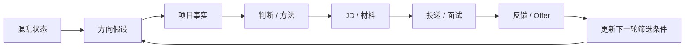

<h1 align="center">CCC — Career Cognition Compass</h1>

<p align="center">
  <a href="README.md">中文</a>
  ·
  <a href="README.en.md">English</a>
</p>

<p align="center">
  从混乱的求职状态，到事实、判断和下一步行动。
</p>

<p align="center">
  <a href="prompts/copy-paste-prompt-lite-cn.md">立即试用</a>
  ·
  <a href="DOWNLOADS.md">下载</a>
  ·
  <a href="DEMO.md">60 秒 Demo</a>
  ·
  <a href="docs/full-guide.md">完整文档</a>
</p>

<p align="center">
  <a href="LICENSE"></a>
  <a href="QUICKSTART.md"></a>
  <a href="DOWNLOADS.md"></a>
  
  
</p>

CCC 是一个开源求职认知与行动工作流。

它不会一上来替你生成一整份简历，而是先帮你把混乱状态整理成事实、判断和下一步行动。

当前阶段：Beta · 持续真实场景测试中。CCC 已可用于个人求职辅助，但公开真实 Smoke Report 覆盖仍为 0，因此不声称对所有模型或所有平台稳定有效。

## 你可能正在经历这些

> “我看了很多岗位，还是不知道该投哪一个。”

> “我现在还在职，但越来越累，也不知道是该继续撑、开始找工作，还是先看看市场。”

> “每个 JD 都像要重新改一份简历，我已经不想改了。”

> “面试官问我：你的判断是什么？我发现我只会复述模型结果。”

> “投了几次、面了几次都没有结果，我开始怀疑是不是方向错了。”

> “两个 Offer 条件完全不同，我不知道到底该看什么。”

## 6 个核心使用场景

| 你现在卡在哪里 | CCC 会帮你做什么 |
| --- | --- |
| 不知道投什么 | Role Family 聚类 + 7 天方向验证 |
| 经历很多但说不清 | 项目事实 + Judgment Trace |
| 每个 JD 都要改简历，很烦 | Master Resume → Role Family Resume → JD Patch |
| 面试一追问就空 | Judgment / Methodology 深挖 |
| 投了、面了，但没有结果 | Funnel + Signal / Pattern 判断 |
| 收到 Offer 不知道怎么选 | Offer 比较 + 谈判 + 决策闭环 |

也支持在职换工作、离职犹豫、在职小规模看机会，以及当前工作 vs 新 Offer 的比较。

查看全部能力：[docs/full-guide.md](docs/full-guide.md)

## 为什么是 CCC？

| 常见做法 | CCC |
| --- | --- |
| 先生成 | 先澄清 |
| 每个 JD 都重写 | Role Family + Patch |
| 一次拒绝就推翻方向 | Signal → Pattern → Conclusion |
| 复述模型结果 | 区分结果和自己的判断 |
| 给很多建议 | 一个主线 + 一个下一步 |

## Before / After

| Before | CCC |
| --- | --- |
| “gap 一年，运营、AI、产品都想投……” | 本轮主线：先验证最有证据的 Role Family |
| 每个方向都想一起准备 | 其他分支暂存，下一轮可以用短标签继续 |
| 不知道项目算不算经历 | 先还原项目事实，再判断能否进入材料 |
| 面试反馈让人怀疑自己 | 区分一次反馈、重复信号和真正需要补的证据 |
| 不知道今天做什么 | 下一步：只给一个能完成的小动作 |

完整演示：[DEMO.md](DEMO.md)；长案例：[examples/full-walkthrough.md](examples/full-walkthrough.md)

## 60 秒 Demo

CCC 的核心体验不是“产出一堆材料”，而是把一段混乱输入收束成一个主线、一个事实卡和一个下一步。

如果你只有 30 分钟或 1 小时，也可以直接告诉 CCC 你的时间预算，它会优先帮你选当前最值得做的一件事。

1. 用户发一段混乱输入。
2. CCC 只抓一个本轮主线，暂存其他分支。
3. 用户回复“继续补项目”。
4. CCC 还原项目事实，不提前包装成成果。
5. 用户提供 JD。
6. CCC 输出一个材料补丁和下一步。

查看：[DEMO.md](DEMO.md)

## Career Cognition Loop

CCC 不是线性求职漏斗，而是帮助你在投递、面试、反馈和 Offer 之间循环更新认知。



原则：没有结果，也会留下信号；但不是每一个信号都足以成为结论。

## 地区 / 市场上下文

CCC 会区分“对话语言”和“求职市场”。

你使用中文还是英文，不决定你在哪个市场求职。只有当地区、目标市场、工作许可、搬迁、远程限制或当地招聘惯例会改变当前判断时，CCC 才会进入对应上下文。

## 最快开始

| 入口 | 适合谁 | 怎么开始 |
| --- | --- | --- |
| 🚀 普通用户 | 想马上试用、省 token 或手机端使用 | 复制 [Lite Prompt](prompts/copy-paste-prompt-lite-cn.md) |
| 🛠 Codex / Claude Code | 想使用可拆分 Skill 的人 | 查看 [SKILLS.md](SKILLS.md) |
| 📱 WorkBuddy | 想做国内可访问 Agent | 复制 [WorkBuddy Lite Prompt](workbuddy/system-prompt-lite.md) |

其他入口：[QUICKSTART.md](QUICKSTART.md)

## CCC 不会做什么

- 不承诺帮你拿到 Offer。
- 不替你决定离职、裸辞、接受 Offer 或职业方向。
- 不鼓励编造经历、数据、证书、项目结果或“完美人设”。
- 不把一次面试反馈直接当成你的长期缺陷。
- 不用一堆看似有用的材料制造新的焦虑。

使用前请先脱敏，不要提交身份证、真实电话、私人邮箱、Offer、合同、薪资截图、完整简历、完整面试记录或公司内部信息。CCC 只提供整理、分析和建议，最终决定仍由使用者自己做。

也可以直接粘贴 HR 在约面前问的问题，让 CCC 帮你组织成自然、可发送的回复。

## 更多资源

| Start | Use | See | Build |
| --- | --- | --- | --- |
| [Quickstart](QUICKSTART.md) | [Full Guide](docs/full-guide.md) | [Demo](DEMO.md) | [Eval](evals/README.md) |
| [Downloads](DOWNLOADS.md) | [Skills](SKILLS.md) | [Examples](examples/full-walkthrough.md) | [Contributing](CONTRIBUTING.md) |
| [Lite Prompt](prompts/copy-paste-prompt-lite-cn.md) | [WorkBuddy](workbuddy/README.md) | [Compatibility](docs/compatibility.md) | [Changelog](CHANGELOG.md) |
| [Roadmap](ROADMAP.md) | [English README](README.en.md) | [Scenario Examples](examples/direction-confusion.md) | [Release Notes Template](docs/release-notes-template.md) |

配套 LaTeX 简历模板：[latex-resume-template-cn-en](https://github.com/Errno722/latex-resume-template-cn-en)

## Repository Map

```text
skills/       核心 Skill
prompts/      普通 LLM Prompt
workbuddy/    WorkBuddy 部署
evals/        行为测试
usability/    纵向可用性测试
docs/         完整文档
```

<details>
<summary><strong>🧪 Developer & Evaluation</strong></summary>

45 behavior contracts · deterministic eval runner · public smoke testing pending

```bash
node scripts/check-evals.mjs
node scripts/check-shared-rules.mjs
node scripts/check-markdown-links.mjs
node scripts/test-deterministic-runner.mjs
node scripts/test-generate-smoke-report.mjs
git diff --check
```

这些校验不会调用模型。`check-evals.mjs` 检查 eval schema、真实 skill ID、手工案例映射、语义断言登记、核心 rubric 标记和已保存结果报告结构；`check-shared-rules.mjs` 检查共享规则版本标记；`check-markdown-links.mjs` 检查公开文档本地链接；`test-deterministic-runner.mjs` 用 fixture 验证确定性 runner；`test-generate-smoke-report.mjs` 在临时仓库验证 Smoke Report 生成流程。语义断言仍需要对应平台的人工抽检或未来 LLM Judge。

当前测试状态：

```text
手工测试场景：45
机器可读合约：45
已登记语义断言：245
已人工细化核心 Rubric：138
确定性 Runner：0.2.0
结果报告 Schema：0.2.0
结果报告：0
总执行次数：0
声明唯一覆盖：0/45
Runner 执行覆盖：0/45
公开平台覆盖：0/45
Runner 唯一通过：0/45
公开唯一通过：0/45
已验证 Runner 通过：0/45
公开已验证通过：0/45
语义已审次数：0
评估对象：assistant_output_only
```

生成第一份真实平台 Smoke Report：

```bash
cp evals/inputs/chatgpt-smoke.template.json \
  evals/inputs/chatgpt-smoke.input.json

# 先提交当前合约，再用完整 HEAD 替换 source_commit
git status --short
git rev-parse HEAD

# 手动填入真实平台模型名称、source_commit 和五个真实助手回复

node scripts/generate-smoke-report.mjs \
  evals/inputs/chatgpt-smoke.input.json
```

填写后的 `*.input.json` 默认不提交；只有确认回复为合成、脱敏测试数据时，才提交生成的 `evals/results/<adapter>/*.json`。在没有真实模型输出前，不要生成或提交 Smoke Report。

</details>

## License / Contributing / Support

CCC 使用 [MIT License](LICENSE)。

发现问题：提交脱敏反馈，参考 [FEEDBACK.md](FEEDBACK.md)。

想参与改进：先看 [CONTRIBUTING.md](CONTRIBUTING.md) 和 [SECURITY.md](SECURITY.md)。

支持与赞赏：[SUPPORT.md](SUPPORT.md)
