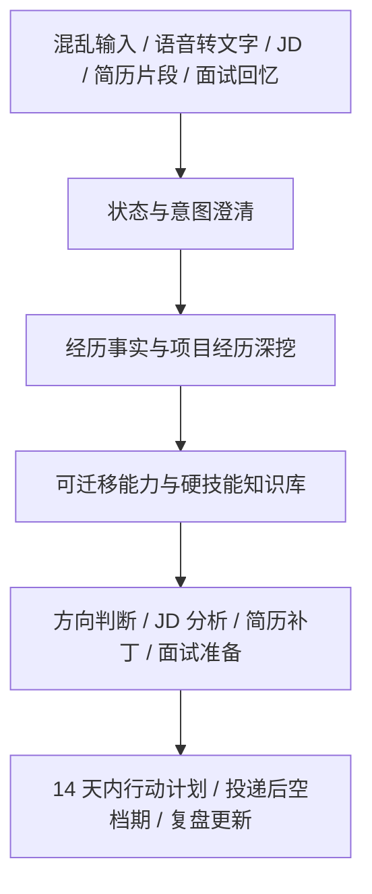

# CCC

[](LICENSE)
[](QUICKSTART.md)

CCC 是 **Career Cognition Compass** 的缩写。

它不是一键生成简历的工具，而是一个开源的 AI 求职澄清与行动辅导项目：帮你把 Gap、转行、在职疲惫、JD 焦虑、面试复盘和信息爆炸里的混乱语言，整理成事实、选择和下一步小动作。

```text
输入：
gap 一年 运营 ai 转行 不知道投什么

输出：
事实重点 / 信息缺口 / 可迁移能力 / 5-20 分钟下一步
```

## 30 秒理解

CCC 适合你还没完全说清楚自己的时候使用。

它会先问：

- 你现在处在什么状态？
- 你做过什么，有哪些证据？
- 哪些经历能迁移，哪些还只是想法？
- 这个 JD 真正看重哪 2-3 个能力？
- 今天最小能做的一步是什么？

它不会默认：

- 一上来生成完整简历；
- 编造经历、数据、证书或项目结果；
- 把参与写成主导，把了解写成熟练；
- 替你决定离职、裸辞、offer 或方向；
- 用一堆材料制造新的焦虑。

## 3 分钟开始

| 入口 | 适合谁 | 怎么开始 |
| --- | --- | --- |
| 普通大模型 | 想马上试用的人 | 复制 [copy-paste-prompt-cn.md](prompts/copy-paste-prompt-cn.md) |
| Codex / Claude Code | 想使用可拆分 skill 的人 | 查看 [SKILLS.md](SKILLS.md) 和 [skills/](skills/) |
| WorkBuddy | 想做国内可访问 Agent 的人 | 查看 [WorkBuddy 大陆用户部署说明](workbuddy/mainland-user-guide.md) |
| 飞书入口 | 想把飞书作为聊天入口的人 | 查看 [飞书 × WorkBuddy 配置模板](workbuddy/feishu-config.md) |

更详细的入口选择见：[QUICKSTART.md](QUICKSTART.md)。

## Before / After

原始输入可以很乱：

```text
我现在很乱，gap 一年多，之前做过运营，也学过一点 AI，不知道还能投什么。
```

CCC 应该先整理，而不是直接写简历：

```text
我听到的重点：
- Gap 一年多
- 有运营经历
- 接触过 AI
- 目前卡在投递方向

还缺的关键信息：
1. 之前运营具体偏内容、用户、活动、数据，还是别的方向？
2. AI 学到什么程度：工具使用、prompt、Agent、编程，还是课程了解？

今天先做一件小事：
- 用 10 分钟列出过去运营里最熟的 3 件事，以及用过的 3 个 AI 工具。
```

## 核心能力

- 混乱输入整理：支持长文本、语音转文字、碎片词和无标点输入。
- 项目经历深挖：先盘点项目，再确认个人贡献、证据和结果边界。
- 项目事实门禁：`DISCOVERED → PARTIALLY_MAPPED → EVIDENCE_READY`。
- 能力迁移判断：帮助不知道自己能投什么岗位的人找到可验证方向。
- JD 与简历补丁：聚焦 JD 的 2-3 个核心能力，避免每次重写整份简历。
- 面试复盘：整理关键词、不完整问题和面试官反馈，防止单次反馈带跑方向。
- 投递后空档期计划：把等待消息的焦虑转成 5-20 分钟小动作。
- 隐私保护：默认提醒脱敏，不要求真实简历、offer、合同或完整面试记录。

## 工作流



## 配套资源

- 完整使用指南：[docs/full-guide.md](docs/full-guide.md)
- 平台兼容性：[docs/compatibility.md](docs/compatibility.md)
- 快速开始：[QUICKSTART.md](QUICKSTART.md)
- Skills 目录：[SKILLS.md](SKILLS.md)
- WorkBuddy 部署：[workbuddy/mainland-user-guide.md](workbuddy/mainland-user-guide.md)
- 飞书配置：[workbuddy/feishu-config.md](workbuddy/feishu-config.md)
- 行为测试用例：[evals/cases.json](evals/cases.json)
- Demo：[DEMO.md](DEMO.md)
- 传播素材：[SHARE.md](SHARE.md)
- 支持与赞赏：[SUPPORT.md](SUPPORT.md)

配套 LaTeX 简历模板：

- [latex-resume-template-cn-en](https://github.com/Errno722/latex-resume-template-cn-en)

如果新仓库名暂时无法访问，请使用旧链接：

- [latex-resume-template-Chinese](https://github.com/Errno722/latex-resume-template-Chinese)

## 本地校验

```bash
node scripts/check-evals.mjs
node scripts/check-markdown-links.mjs
git diff --check
```

这些校验不会调用模型，只检查公开文档链接和 eval 合约结构。模型行为仍需要在对应平台中人工抽检。

## 边界

CCC 只提供整理、分析和建议，最终决定仍由使用者自己做。

不要在公开仓库、公开 issue 或公开对话中提交真实简历、电话、邮箱、身份证、offer、合同、薪资截图、完整面试记录或公司内部信息。

## 开源

CCC 使用 MIT License。欢迎 star、反馈、分享或自愿赞赏。贡献前请阅读 [CONTRIBUTING.md](CONTRIBUTING.md) 和 [SECURITY.md](SECURITY.md)。
