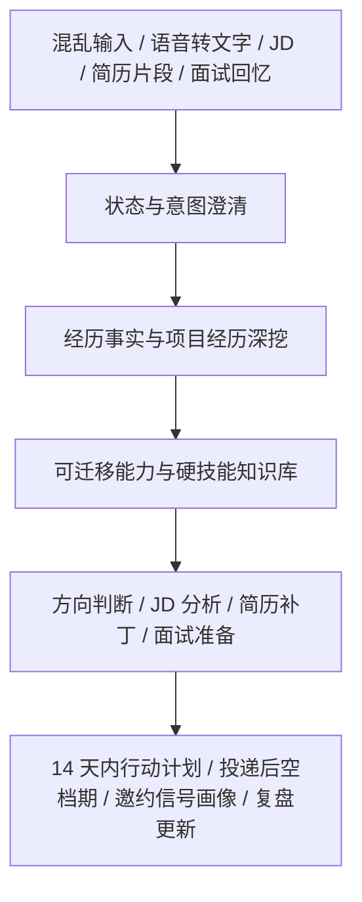

# CCC — Career Cognition Compass

[](LICENSE)
[](QUICKSTART.md)

CCC 是 **Career Cognition Compass** 的缩写。

它不是一键生成简历的工具，而是一个开源的 AI 求职澄清与行动辅导项目：帮你从信息爆炸、Gap、转行、在职疲惫、JD 焦虑和面试复盘里，整理出事实、选择和下一步小动作。

## 你可以直接这样开始

不需要先写结构化表格。你可以发一段很乱的话，也可以一句一句来：

```text
我现在很乱，gap 一年多，之前做过运营，也学过一点 AI，不知道还能投什么。
```

```text
我在职，但每天很累，下班后恢复不过来，也不知道该不该离职。
```

```text
这是一个产品运营 JD，帮我看硬技能、岗位类型和我应该怎么准备。
```

CCC 会先抓住本轮主线，暂存其他分支，再给你一个能继续推进的小动作。

## 它会帮你做什么

- 把混乱输入整理成事实、缺口、暂存分支和下一步。
- 根据项目、工作任务和最近愿意继续做的事，形成可验证的定位假设。
- 深挖项目经历，区分“亲自做过”“参与过”“只是了解”和“还没有证据”。
- 拆解 JD 的岗位类型和核心能力，避免只按岗位标题改材料。
- 做简历补丁、英文表达、面试准备和面试复盘，但不默认替你编造或夸大。
- 在投递后、等待面试反馈、Gap 焦虑或信息过载时，帮你回到可控的小动作。

## 最快使用方式

| 入口 | 适合谁 | 怎么开始 |
| --- | --- | --- |
| ChatGPT / 普通 LLM | 想马上试用、省 token 或手机端使用的人 | 复制 [copy-paste-prompt-lite-cn.md](prompts/copy-paste-prompt-lite-cn.md) |
| 普通 LLM 完整版 | 想要完整规则的人 | 复制 [copy-paste-prompt-cn.md](prompts/copy-paste-prompt-cn.md) |
| Codex / Claude Code | 想使用可拆分 skill 的人 | 查看 [SKILLS.md](SKILLS.md) 和 [skills/](skills/) |
| WorkBuddy | 想做国内可访问 Agent 的人 | 优先使用 [system-prompt-lite.md](workbuddy/system-prompt-lite.md)，完整说明见 [WorkBuddy 大陆用户部署说明](workbuddy/mainland-user-guide.md) |

更详细的入口选择见：[QUICKSTART.md](QUICKSTART.md)。

## 隐私提醒

不要发送身份证、真实电话、私人邮箱、offer、合同、薪资截图、完整简历、完整面试记录或公司内部信息。可以先用“某平台”“某公司”“某岗位”“联系方式已脱敏”替代。

CCC 只提供整理、分析和建议，最终决定仍由使用者自己做。

## 它不会做什么

- 不承诺帮你拿到 offer。
- 不替你决定离职、裸辞、接受 offer 或职业方向。
- 不鼓励编造经历、数据、证书、项目结果或“完美人设”。
- 不把一次面试反馈直接当成你的长期缺陷。
- 不用一堆看似有用的材料制造新的焦虑。

## Before / After

原始输入可以很乱：

```text
我现在很乱，gap 一年多，之前做过运营，也学过一点 AI，不知道还能投什么。
```

CCC 应该先整理，而不是直接写简历：

```text
我听到的重点：
- Gap 一年多
- 有运营经历
- 接触过 AI
- 目前卡在投递方向

还缺的关键信息：
1. 之前运营具体偏内容、用户、活动、数据，还是别的方向？
2. AI 学到什么程度：工具使用、prompt、Agent、编程，还是课程了解？

今天先做一件小事：
- 用 10 分钟列出过去运营里最熟的 3 件事，以及用过的 3 个 AI 工具。
```

## 核心能力

- 混乱输入整理：支持长文本、语音转文字、碎片词和无标点输入。
- 项目经历深挖：先盘点项目，再确认个人贡献、证据和结果边界。
- 项目事实门禁：`DISCOVERED → PARTIALLY_MAPPED → EVIDENCE_READY`。
- 能力迁移判断：帮助不知道自己能投什么岗位的人找到可验证方向。
- 近期工作行为定位：根据最近实际在做、愿意继续做或做完更有掌控感的工作任务，形成定位假设；不把爱好直接当职业结论。
- 发散收束：当用户同时想投很多方向、学很多技能、做很多材料时，先归类分支，只推进 1 个本轮主线。
- JD 与简历补丁：先判断 JD 岗位类型和工作重心，再聚焦 2-3 个核心能力，避免每次重写整份简历。
- 面试准备与复盘：整理关键词、不完整问题和面试官反馈，输出候选人面试资料卡补丁；按 HR、业务、技术等面试官角色调整回答侧重点；用面试表达结构卡训练清晰回答；自我介绍和面试答案默认给可记忆框架；面试反问卡只给岗位级小问题。
- 语气校准与英文面试：简历和面试准备避免过度肯定，英文表达不逐句硬翻译，优先给自然、可说出口、可验证的英文框架和短句。
- 投递后空档期计划：把等待消息的焦虑转成 5-20 分钟小动作。
- 焦虑降噪：刷社媒更慌、反复刷新、等待反馈或比较别人时，拆出触发源、可控/不可控、信息摄入边界和一个小动作，不灌鸡汤。
- 面试邀约信号画像：根据已收到的面试邀请、JD 和无回复样本，区分邀约构成、本批次观察回复率和下一批验证假设。
- Token 节省模式：复用已有状态卡、项目卡、主简历和 JD 补丁，只输出差异、替换段落和下一步；必要时输出 `CCC 继续上下文`，减少跨模型或手机端反复消耗。
- 隐私保护：默认提醒脱敏，不要求真实简历、offer、合同或完整面试记录。
- 共享规则：`core/` 维护 focus control、确定性表达校准和 profile 持久化边界，避免不同入口规则漂移。

## 工作流



## 配套资源

- 完整使用指南：[docs/full-guide.md](docs/full-guide.md)
- 平台兼容性：[docs/compatibility.md](docs/compatibility.md)
- 快速开始：[QUICKSTART.md](QUICKSTART.md)
- Skills 目录：[SKILLS.md](SKILLS.md)
- WorkBuddy 部署：[workbuddy/mainland-user-guide.md](workbuddy/mainland-user-guide.md)
- 飞书配置：[workbuddy/feishu-config.md](workbuddy/feishu-config.md)
- 轻量复制 Prompt：[prompts/copy-paste-prompt-lite-cn.md](prompts/copy-paste-prompt-lite-cn.md)
- WorkBuddy 轻量系统提示词：[workbuddy/system-prompt-lite.md](workbuddy/system-prompt-lite.md)
- 纵向可用性测试：[usability/README.md](usability/README.md)
- Eval 合约：[evals/cases.json](evals/cases.json)、[evals/schema.json](evals/schema.json)、[evals/result-schema.json](evals/result-schema.json)、[evals/rubrics.json](evals/rubrics.json)
- 真实 Smoke Report 输入模板：[evals/inputs/README.md](evals/inputs/README.md)
- Demo：[DEMO.md](DEMO.md)
- 传播素材：[SHARE.md](SHARE.md)
- 支持与赞赏：[SUPPORT.md](SUPPORT.md)

配套 LaTeX 简历模板：

- [latex-resume-template-cn-en](https://github.com/Errno722/latex-resume-template-cn-en)

## 开发者与测试

CCC 的工程化测试信息放在这里，避免第一次打开仓库的人被 Eval、Schema 和 Runner 细节挡住。

```bash
node scripts/check-evals.mjs
node scripts/check-shared-rules.mjs
node scripts/check-markdown-links.mjs
node scripts/test-deterministic-runner.mjs
node scripts/test-generate-smoke-report.mjs
git diff --check
```

这些校验不会调用模型。`check-evals.mjs` 检查 eval schema、真实 skill ID、手工案例映射、语义断言登记、核心 rubric 标记和已保存结果报告结构；`check-shared-rules.mjs` 检查共享规则版本标记；`check-markdown-links.mjs` 检查公开文档本地链接；`test-deterministic-runner.mjs` 用 fixture 验证确定性 runner；`test-generate-smoke-report.mjs` 在临时仓库验证 Smoke Report 生成流程。语义断言仍需要对应平台的人工抽检或未来 LLM Judge。

当前测试状态：

```text
手工测试场景：33
机器可读合约：33
已登记语义断言：193
已人工细化核心 Rubric：86
确定性 Runner：0.2.0
结果报告 Schema：0.2.0
结果报告：0
总执行次数：0
声明唯一覆盖：0/33
Runner 执行覆盖：0/33
公开平台覆盖：0/33
Runner 唯一通过：0/33
公开唯一通过：0/33
已验证 Runner 通过：0/33
公开已验证通过：0/33
语义已审次数：0
评估对象：assistant_output_only
```

生成第一份真实平台 Smoke Report：

```bash
cp evals/inputs/chatgpt-smoke.template.json \
  evals/inputs/chatgpt-smoke.input.json

# 先提交当前合约，再用完整 HEAD 替换 source_commit
git status --short
git rev-parse HEAD

# 手动填入真实平台模型名称、source_commit 和五个真实助手回复

node scripts/generate-smoke-report.mjs \
  evals/inputs/chatgpt-smoke.input.json
```

填写后的 `*.input.json` 默认不提交；只有确认回复为合成、脱敏测试数据时，才提交生成的 `evals/results/<adapter>/*.json`。在没有真实模型输出前，不要生成或提交 Smoke Report。

## 开源

CCC 使用 MIT License。

下一步可以这样做：

- 第一次使用：复制轻量版 [copy-paste-prompt-lite-cn.md](prompts/copy-paste-prompt-lite-cn.md)；需要完整规则时再用 [copy-paste-prompt-cn.md](prompts/copy-paste-prompt-cn.md)。
- 发现问题：提交脱敏反馈，参考 [FEEDBACK.md](FEEDBACK.md)。
- 想参与改进：先看 [CONTRIBUTING.md](CONTRIBUTING.md) 和 [SECURITY.md](SECURITY.md)。
