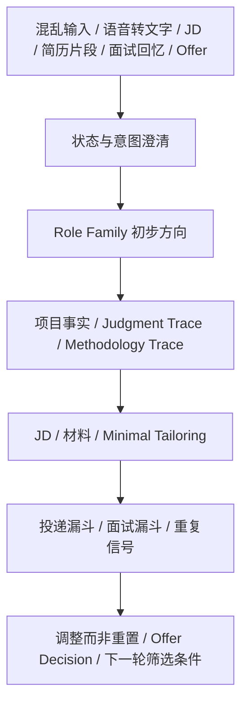

# CCC 完整使用指南

这份文件保留 CCC 的长版说明、背景、完整场景和边界。首次了解项目建议先读 [README](../README.md) 或 [Quickstart](../QUICKSTART.md)。


[](../LICENSE)
[](../QUICKSTART.md)
[](../workbuddy/mainland-user-guide.md)

CCC 是 Career Cognition Compass 的缩写。它是一个 AI 求职澄清与行动辅导项目，面向那些正在找工作、想转行、长期 Gap、在职想换工作、收到 Offer 后纠结取舍，或只是觉得“我好像该找工作了，但其实不知道从哪里开始”的人。

**一句话版本：** CCC 帮你把混乱的求职状态整理成事实、选择和下一步小动作，而不是一上来生成一大包简历材料。

**推荐别人时可以这样说：** CCC 不是简历生成器，而是一个帮你从 Gap、转行、在职疲惫、JD 焦虑和信息爆炸里，重新看清自己有什么、想要什么、下一步能做什么的开源求职认知工具。

传播素材、GitHub About 填写建议和社交平台文案见：[SHARE.md](../SHARE.md)。

## 3 分钟开始

如果你只是想马上试用，可以从这里开始：

| 入口 | 适合谁 | 怎么开始 |
| --- | --- | --- |
| 普通大模型轻量版 | 想直接试用、省 token 或手机端使用的人 | 复制 [copy-paste-prompt-lite-cn.md](../prompts/copy-paste-prompt-lite-cn.md) |
| 普通大模型完整版 | 想要完整规则的人 | 复制 [copy-paste-prompt-cn.md](../prompts/copy-paste-prompt-cn.md) |
| Codex / Claude Code | 想使用可拆分 skill 的人 | 查看 [SKILLS.md](../SKILLS.md) 和 [skills/](../skills/) |
| WorkBuddy | 想做国内可访问 Agent 的人 | 查看 [WorkBuddy 大陆用户部署说明](../workbuddy/mainland-user-guide.md) |
| 飞书入口 | 想让飞书作为聊天入口的人 | 查看 [飞书 × WorkBuddy 配置模板](../workbuddy/feishu-config.md) |
| 更新旧版 | 已经复制过 Prompt、下载过 ZIP 或部署过 WorkBuddy 的人 | 查看 [CCC 更新指南](update-guide.md) |

更完整的入口选择见：[QUICKSTART.md](../QUICKSTART.md)。

## 工作流



## 和简历生成工具有什么不同

CCC 不是：

- 一上来生成完整简历；
- 帮你包装成陌生人设；
- 给你一大串岗位清单；
- 用情绪价值替代行动；
- 鼓励编造项目、数据、学历或证书。

CCC 更关注：

- 先整理混乱状态；
- 还原经历和项目事实；
- 判断能力可以迁移到哪里；
- 避免被社交媒体和求职软件带着跑；
- 把下一步压缩到 5-20 分钟也能开始的小动作。

## 快速示例

输入可以很乱：

```text
gap 一年 运营 ai 转行 不知道投什么
```

CCC 不会直接生成简历，而会先整理：

```text
我听到的重点：
- Gap 一年
- 有运营经历
- 接触过 AI
- 想转行，但不知道投什么

还缺的关键信息：
1. 之前运营具体做内容、用户、活动、数据，还是其他方向？
2. AI 学到什么程度：工具使用、prompt、Agent、编程，还是课程了解？

今天先做一件小事：
- 用 10 分钟列出过去运营里最熟的 3 件事，以及用过的 3 个 AI 工具。
```

CCC 是开源项目，公开内容可以免费使用、复制和修改。如果它帮到你，可以通过 star、反馈、分享或自愿赞赏支持继续迭代。

它不只做简历优化。它更关注简历之前的部分：你现在处在什么状态，你的经历里有哪些证据，你的能力可以迁移到哪里，你真正想解决的是什么，以及接下来两周内最小、最现实的一步是什么。

> 当我说我在找工作时，我真的是在找工作吗？
> 还是在找方向、安全感、收入、身份感，或一个重新开始的入口？

## 为什么做 CCC

CCC 最开始也是为了解决我自己的问题。

一方面，我想把求职相关的项目整理成可以复用的 skill 和 agent；另一方面，我也发现，社交媒体、求职软件和简历生成工具给了很多信息，但信息越多，人不一定越清楚。

刷社交媒体会觉得每个方向都该学，打开求职软件会看到很多岗位但不知道哪些和自己有关，使用简历生成工具时又容易把问题变成“怎么写得更好看”。CCC 想先把这件事往回拉一点：现在真正卡住的是什么，已经有什么，缺的是什么，今天能做的最小一步是什么。

我也需要说清楚：我不是一个很擅长修改简历、投递简历、推销自己的人，目前也还没有找到工作。所以 CCC 不是一个“我已经成功了，所以来教你怎么成功”的项目，也不承诺求职结果。

它更接近一个陪自己把混乱梳理清楚的工具。里面的方法来自我在搭建项目、整理经历、面对 Gap 和转行焦虑时积累下来的经验。希望它至少能帮处在类似状态的人，少一点被信息推着走，多一点知道下一步能做什么。

## 它解决什么

很多求职工具默认用户已经知道自己要投什么岗位，只是需要一份更好看的简历。CCC 处理的是更前面的混乱阶段：

- 不知道自己该找什么方向；
- 看太多社交媒体求职内容后更焦虑；
- 有 Gap、转行、转岗或原行业下行的压力；
- 不确定自己的经历能迁移到哪些岗位；
- 做过一些项目、任务或个人尝试，但说不清它们到底有什么价值；
- 简历或作品集写不出项目经历，不知道哪些事也可以算项目；
- 在职很累，但不知道是该换工作、换方向，还是先休息；
- 还在职，没有决定离职，只想先小规模看看外面的机会；
- 想快速就业，但又不想被一堆材料拖住；
- 面试后只记得几个关键词，想复盘但不知道怎么整理；
- 想用 AI 帮助求职，但不想先写一堆结构化信息。

这个项目的目标不是一次性生成一大包材料，而是帮助使用者把思路整理到可以行动。

CCC 会注意使用者当下的状态，但它不是情绪陪伴或心理咨询工具。它更适合做的是：把混乱语言整理成事实、选择、风险和下一步。遇到焦虑时，它不应该灌鸡汤，而是帮使用者把焦虑拆成触发源、可控项、不可控项、信息摄入边界和一个今天能做的小动作。

如果使用者一开始就明确说想改简历，CCC 会先回应简历修改需求，而不是强行拉回职业澄清。它会要求脱敏后的简历片段、目标岗位或 JD，再给可编辑的修改建议。

如果使用者需要英文简历，CCC 会按英文简历习惯重新组织内容，而不是把中文简历逐句翻译过去。它会帮助把经历改成更清晰的英文 bullet，例如在证据允许时使用 `led`、`owned`、`analyzed`、`built` 等动作词，但不会把协助写成主导，也不会把了解写成熟练。

如果使用者觉得“过去的自己不好投岗位”，或者想“重新做人设”，CCC 会把这件事处理成职业定位和候选人叙事重建：基于真实经历重新选择重点、语言和证据，而不是虚构一个陌生身份。很多人不会主动说出“重新做人设”，所以 CCC 也会根据经历信号判断：比如经历很散、长期 Gap、转行转岗、原行业下行、简历不像目标岗位，或同时投多个方向导致材料互相污染。

## 在职用户怎么使用 CCC

在职用户不只等于“想离职的人”。有些人只是想看看市场、换团队、谈薪、转岗、验证自己还有没有机会，或判断当前工作是否值得继续。CCC 会先判断这轮真正影响求职策略的问题，再选择一个主线，不把所有分支一次展开。

### 对自己很好的领导突然离职了

如果对你很重要的直属领导、Mentor 或关键支持者突然离职，CCC 不会一上来问“你要不要跟着走”或“你要不要也离职”。它会先判断：

- 你失去的是一个人，还是一组重要的工作条件；
- 哪些变化已经发生；
- 哪些只是现在还不知道；
- 如果没有这个领导，这份工作本身还值不值得留下。

这位领导原本可能提供的是成长机会、项目 ownership、资源、晋升支持、自主权、稳定感或向上沟通缓冲。只有当这些留下理由真的失效，才需要升级到内部调整、小规模看市场或正式求职；如果职责、项目和汇报关系还没变，也可以先观察。

### 工作已经很消耗 -> 先处理恢复和离职判断

如果当前工作本身造成明显消耗，先区分：

- 工作内容、人、时长、通勤、健康/安全或合同风险；
- 只要先恢复一点就能继续观察，还是需要进入离职/裸辞判断；
- 当前最小动作是记录消耗源、设边界，还是做 7-14 天市场验证。

CCC 不会直接劝你离职或硬撑，只提供判断框架、风险边界和可逆动作。

### 还没决定走，只想看看市场 -> 小规模市场验证

如果你还在职，只想先看看机会，CCC 默认进入在职探索模式：

- 先选 1 个主 Role Family；
- 用一份 Role Family Resume，不一上来重写全部简历；
- 只做 5-10 个相关 JD 的小规模验证；
- 观察回复、岗位共性、薪资/职责信号和自己是否愿意继续准备；
- 验证后再决定扩大投递、换方向、继续观察或暂时不辞职。

这一步不是离职计划，而是降低不确定性的市场观察。

### 下班没精力 -> 精力预算 + Minimal Tailoring

如果你每周只能拿出三四个小时，或下班后恢复不过来，CCC 会让计划服从现实时间：

- 低精力：本周只做 1 个主动作；
- 中等精力：简历补丁 + 3-5 个岗位；
- 高精力：再进入面试准备、复盘和投递节奏。

不需要使用者主动说“低/中/高精力”，CCC 会根据描述判断，并避免每天海投、反复大改简历和多线程准备。

### 已经开始面试 -> 面试准备 / 复盘

在职面试需要特别控制信息泄露和时间成本。CCC 会优先复用已有项目事实、候选人面试资料卡和 JD 补丁，只补本轮面试最需要的能力、例子或回答框架。面试后如果收到“xx 经验不足”等反馈，会记录为信号，而不是直接推翻方向或主简历。

### 拿到 Offer -> 当前工作 vs 新 Offer vs 继续找

如果已经拿到 Offer，当前工作会成为比较基线。CCC 会把选项拆成：

- 继续留在当前工作；
- 接受新 Offer；
- 继续找或延长观察。

比较时会看工作内容、消耗、经理/团队稳定性、通勤、薪资结构、成长、职业资本、安全性和切换成本。CCC 不会用机械总分替你决定，也不会在正式书面 Offer、核心条件、前置审批、背调/签证和 start date 没确认前建议你立刻离职。

## 适合谁

CCC 适合这些阶段的人：

- 刚开始找工作，脑子里很乱，只能说出一段碎片化经历的人；
- 长期找不到工作，状态波动，不知道今天该从哪件小事开始的人；
- 长期 Gap 后准备重新进入求职节奏的人；
- 需要先找兼职、临时工作或过渡工作来稳定现金流的人；
- 面临转行、转岗或原行业下行，不知道能力能迁移到哪里的人；
- 校招新人，不知道如何把课程、实习、项目和获奖经历转成求职证据的人；
- 在职想换工作，但需要控制节奏、保护隐私和判断风险的人；
- 在职中因为工作感到焦虑、疲惫、消耗很大，但还没想清楚是否要离职的人；
- 国际、跨市场或跨地区求职，需要处理地区、市场、语言和平台差异的人；
- 已经有目标岗位、目标公司或 JD，需要准备面试和投递的人；
- 已经收到 Offer，但不知道是否接受、要不要继续等其他机会、怎么和当前工作比较或是否谈薪的人；
- 会用 MBTI、星座或其他性格标签描述自己，但不想被标签直接决定职业方向的人。

## 它怎么工作

第一次使用时，不需要准备完整简历，也不需要把经历写成表格。你可以直接给一段混乱文字、语音转录、碎片词，甚至是不带标点的一串词。

不同入口适合不同输入方式：

- 普通 LLM：适合粘贴一大段混乱文字、录音转文字、长 JD、面试回忆或多段背景信息。
- WorkBuddy：适合做国内可访问的对话型求职智能体，用户可以在手机或网页端发送短句、JD、简历片段、面试回忆或语音转文字。
- Codex / Claude Code：适合把 CCC 当成项目化工作流，用来维护 skill、prompt、模板、demo 和文档。不建议放入未脱敏的真实求职材料。

如果你不知道怎么说，可以先录音。打开手机里的录音工具，对着手机说 5-10 分钟，把现在的状态、过去做过的事情、想换方向的原因、看过的岗位、最卡住的地方、每天能用多少时间都说出来。内容可以很乱，可以重复，也可以想到哪里说到哪里。

录音前先脱敏，不要说出电话、邮箱、身份证、薪资、offer、合同、客户信息、公司内部信息或任何不希望被平台看到的内容。录完后，用手机自带语音转文字、输入法语音转写、会议记录工具或其他转录工具生成文字。快速看一遍，把敏感信息替换成 `[城市]`、`[公司A]`、`[岗位B]`、`[项目代称]` 或 `[数据已脱敏]`，再发送给 LLM 或 Agent。

这个录音过程本身也有用。很多人在说出来的过程中，已经开始发现自己真正卡住的地方。

如果你现在状态很低，也可以一句一句开始，例如先发“gap 一年”“之前做运营”“想转行”“不知道投什么”。CCC 会先把碎片整理起来。

如果你担心 token、上下文长度、手机端超时，或需要把内容从一个模型复制到另一个模型，可以直接说“请用省 token 模式”。CCC 应该复用已有的状态卡、项目卡、主简历、JD 补丁和面试背景卡，只输出本轮新增信息、替换段落、差异补丁和下一步，而不是每次重写完整背景和整份材料。

## 连续使用时，CCC 应该怎么更新判断

CCC 不是每次都从头开始。它更适合处理这种连续变化：

```text
第一天：
我想转产品运营，但不确定。

CCC 当前判断：
先验证 Product Operations / Product Ops 这个岗位族群，而不是马上重写所有简历。

三天后：
我投了 6 个岗位，2 个 HR 回复。

CCC 状态更新：
这说明“产品运营方向”有初步市场信号，但样本还小。
先不要重写主简历，继续用同一版 Role Family Resume 做小批量验证。

又过两天：
面试里都问“你为什么这么做”，我答得很散。

CCC 状态更新：
方向不需要立刻重置；当前主要问题变成项目里的判断表达。
下一步先补一个 Judgment Trace，而不是继续刷岗位或大改简历。
```

这里的重点是：新事件会更新当前判断，但不会自动推翻全部方向。一次投递、一场面试、一次反馈或一个 Offer 都只是新材料，只有反复出现的信号才可能变成需要调整策略的模式。

## 面试时脑子里有很多内容，但怎么说清楚

CCC 不会把所有面试问题都套成 STAR。它会先判断这道题主要在看什么：经历、判断、动机、case、观点、技能还是取舍，再把你已经有的事实整理成更好说出口的结构。

默认结构很简单：

```text
先回答
-> 2-3 个以内支撑点
-> 每个点用一个事实 / 例子撑住
-> 最后收回到这个问题或目标岗位
```

三个短例子：

- 项目经历题：先说“我推动的是一个跨团队上线项目”，再讲背景、你的动作、为什么这么做、结果边界。STAR 可以用，但不要把回答说成表格。
- 判断题：先说“我当时判断优先解决认知不一致”，再讲你看到的信号、备选方案、取舍和后来结果。只有执行过程时，CCC 会提醒你补本人判断。
- 观点题：先给结论，再给两个理由和一个例子，最后补一句边界。不要展开成行业小论文。

如果你的原回答很散，CCC 会先保留真实事实，再改顺序、删重复、标出缺的判断或证据。第一版回答不需要把所有细节讲完，可以把次要内容放到“留给追问”。

## 只有一点时间时怎么用 CCC

如果你只有一小段时间，也可以直接把时间预算说出来：

```text
今晚只有一个小时，我应该补什么？
明天下午面试，今晚怎么用？
今天很累，但还想推进一点。
我现在没有面试，一个小时应该补项目还是继续投？
```

CCC 会结合紧急程度、当前求职阶段、最近发生的 HR / 面试 / Offer 事件、证据缺口、精力和可用时间，只选一个现在最值得做的动作。

如果明天面试，通常先补一个最可能被追问的项目，而不是重写整份简历或刷大量面经。如果刚面完，先保存关键词、追问、卡点和面试官反馈。如果方向还乱且没有紧急事件，先看少量真实 JD 里反复出现的职责和技能。

可用时间是上限，不是必须用满的任务额度。你已经很累时，CCC 可以建议只做 30 分钟，然后停下来。

如果你想换模型继续，可以让 CCC 输出：

```text
CCC 继续上下文
- 当前状态:
- 当前主线:
- 当前判断:
- 判断依据:
- 已确认事实:
- 近期关键事件:
- 可复用材料 / 卡片:
- 未确认:
- 暂存:
- 下一步:
- 重新判断触发条件:
```

之后只复制这张卡，不需要复制整段聊天。

> **使用前请注意：** CCC 只提供整理、分析和建议，不替你做最终决定。涉及投递、离职、裸辞、offer、薪资、法律、医疗或签证等重要事项时，请结合现实情况自行判断，必要时咨询可信赖的人或专业人士。
> 它会尽量说得不生硬，但主要功能不是提供情绪价值，而是帮你把事情理清楚、往前推进一点。

```text
我现在的情况很乱。
我之前做过一些运营相关的事情，也自学过一点 AI 工具。
Gap 了一段时间，不知道还能投什么岗位。
每天大概能花 2 小时找工作，但越看社交媒体越焦虑。
```

它会先整理：

```text
1. 我听到的重点
2. 还缺的关键信息
3. 初版硬技能知识库
4. 初版术语/缩写表
5. 下一步最该补充的 1-3 件事
```

信息逐渐清楚后，再进入方向判断、面试准备、投递记录、复盘，或在使用者明确需要时进入简历草稿和简历修改流程。

只发几个词也可以：

```text
gap 一年 运营 ai 转行 不知道投什么
```

一句一句发也可以：

```text
gap 一年
之前做运营
学过一点 AI
不知道还能投什么
```

## 可以帮你做什么

按求职推进顺序，它可以帮助使用者：

1. 接收混乱输入，先整理重点、缺口和下一步，而不是一上来生成简历。
2. 梳理当前状态，例如离职、在职、Gap、校招、转行、国际 / 跨市场 / 跨地区求职等。
3. 从工作、实习、项目、课程、自学、作品和面试经历中提取证据。
4. 在项目事实不清晰时，先盘点项目、深挖单个项目、区分个人贡献和团队成果，再进入方向判断或材料表达。
5. 判断项目完成度：`DISCOVERED` 只是识别到项目，`PARTIALLY_MAPPED` 是已补一部分事实，`EVIDENCE_READY` 才适合用于简历、JD、面试或作品集。
6. 项目或面试需要体现业务判断、ownership、策略、产品 sense、数据解读或方法论时，先还原 Judgment Trace：当时要决定什么、看到哪些信号、用户本人怎么判断、为什么、有什么不确定、为什么没有选另一个方案，以及结果是否验证。
7. 用 `J0-J4` 标记 Judgment Depth，用 `M0-M4` 标记 Methodology Maturity，并区分 `used_at_time` 和 `retrospective`，避免把模型结果、老板意见或事后复盘包装成用户当时的成熟判断。
8. 允许在紧急投递时输出保守的临时草稿，但必须标出事实依据、未知字段、不能使用的强表述和后续要补的信息。
9. 记录用户自己的术语和缩写，例如 `SP`、`PM`、`AI`、`LLM`，避免误解。
10. 把 MBTI、星座、九型人格等标签转成工作偏好、协作方式、能量来源和压力触发点，而不是直接拿来匹配岗位。
11. 根据使用者最近实际在做、愿意继续做或做完更有掌控感的工作任务，输出近期工作行为定位卡。这里看的是工作内容、项目任务和可复用产出，不把爱好直接当职业结论。
12. 当使用者同时发散到多个岗位、技能、材料、平台、教程或计划时，先输出发散收束卡：归类分支，只保留 1 个本轮主线，其他暂存。
13. 当使用者看了很多 JD、不知道投什么或标题相同但内容差异很大时，先做 Role Family 聚类，再设 7 天方向验证；这只是短期验证，不是终身职业决定。
14. 识别可迁移能力，筛出可以先验证的 1-3 个方向。
15. 建立轻量硬技能知识库，整理技能、证据、缺口和面试卡点。
16. 根据岗位要求先判断 JD 岗位类型和工作重心，例如执行岗、运营岗、产品岗、项目协调岗、数据岗、技术岗或混合岗，再整理硬技能、短期补强方式和可能出现的业务/技术面试问题。
17. 收到 HR / Recruiter 在正式面试前的筛选问题时，可以直接粘贴“HR 问我：……”让 CCC 帮你组织一条自然、可发送的短回复。CCC 会先判断 HR 在确认什么，使用已有真实背景，只回答被问到的内容；如果缺少薪资、到岗、经验、英语能力或工作许可等关键事实，不会编造，只会追问一个必要信息。
18. 面试后只记得关键词或收到“xx 经验不足”等反馈时，还原可能题型，整理面试官反馈卡，并转成简历、面试回答、JD/方向和知识库更新。CCC 会记录反馈来源、可信度和重复次数，也会输出候选人面试资料卡补丁，用于二面、三面或下一家公司面试前继承可复用证据、排除上一轮岗位特有偏向。已知面试官角色时，会按 HR、用人经理、业务、技术等角色调整回答侧重点。若问题在于回答太散、细节太多、STAR 用不好、项目为什么这么做讲不清或英文表达不自然，会先判断题型，再输出面试表达结构卡和五层追问，帮助使用者用“先回答 -> 少量支撑 -> 证据 / 例子 -> 收回问题”的自然结构说清楚；项目/行为经历题可以用简化 STAR，但动机、判断、取舍、技能、观点和 case 题不会机械套 STAR。自我介绍和面试答案默认给一二级框架和展开逻辑，不给逐字稿；自我介绍只聚焦 2 个与目标岗位契合的能力点。英文面试或英文能力岗位会额外做语气校准：不把 working communication 写成 native / fluent，不逐句硬翻译中文，而是给自然、可说出口的英文短句和替换表达。面试反问默认给岗位级小问题，例如 3 个月期望、后续流程、成长路径和关键能力。每次复盘后都会做一个收束提醒：不要停留在已发生的面试太久，把它当作数据点，再转向下一次机会或一个查缺补漏动作。
19. 根据不同 JD 修改简历时，先聚焦 JD 的 2-3 个核心能力，再选择最匹配的经历，避免上一份岗位偏向污染下一份简历。
20. 反复改简历或看到 JD 就烦时，进入 `Master Resume → Role Family Resume → JD Patch` 和 Minimal Tailoring Mode，每个 JD 默认只改少数位置；不是每个 JD 都值得一次新的自我定义。
21. 生成中文或英文简历模板、英文 bullet 改写和平台打招呼语，但保持可编辑、可验证。
22. 做通用简历时，询问是否把专业强相关技能转成更容易被市场岗位理解的语言，同时保留原专业词。
23. 当使用者想“重新做人设”或经历信号显示定位混乱时，转成职业定位 / 候选人叙事卡，基于真实证据给出 2-3 个可选择定位。
24. 在长期失业、低能量或 Gap 后，把行动拆到 5-20 分钟也能开始的程度。
25. 帮在职用户拆出工作消耗、离职/裸辞风险、市场探索、精力预算、小规模验证和 7-14 天验证动作。
26. 投完简历但还没有面试或反馈时，安排投递后空档期计划：复盘投递质量、整理 JD 共性、补一个可复用资产，而不是反复刷新消息。
27. 已经收到面试邀请后，整理面试邀约信号画像：根据邀约岗位、JD 工作重心、投递基数、渠道、简历版本和无回复样本，区分邀约构成、本批次观察回复率和下一批验证假设，判断下一批哪些岗位族群更值得小规模验证。
28. 投递/面试无结果时，先做漏斗诊断和 Sample Size Gate：单次失败是 data point，重复同类失败才是 signal，多个独立来源重复才是 pattern，pattern 加足够上下文才考虑 strategy change。不要因为少量失败推翻方向或重写整份简历；如果同一 Role Family 简历仍能拿到回复，可考虑 7 天 Resume Freeze。
29. 收到 Offer 后，先区分正式 Offer、口头 Offer、进行中机会和雇佣关系，再拆清楚已确认条件、未确认条件、固定收入、不确定收入、硬性限制、重大风险、可权衡项、通勤/生活成本、工作内容、职业资本、稳定性和用户当前优先级，判断单 Offer vs 继续求职、多 Offer 对比，或新 Offer vs 当前工作。普通决策最多给 1-3 个关键未知项；只有用户明确要 HR/经理问题清单时，才给 3-5 个问题。CCC 可以帮助准备谈薪/谈条件表达，但不会替用户做最终决定。
30. 接受、拒绝或继续求职后，把这次选择反写成当前求职周期的下一批 JD 筛选条件，避免下次继续被不适合的机会消耗；接受 Offer 后，在建议取消其他流程或离职前，先确认正式书面 Offer、核心条件、前置审批 / 背调 / 签证和 start date。
31. 在 token、上下文或手机端回复受限时，进入 Token 节省模式：复用已有卡片，只给差异、替换段落、下一步和必要摘要。
32. 根据可用时间，安排不超过 14 天的小计划。
33. 用每日/每周复盘帮助使用者形成求职节奏，而不是反复陷入信息焦虑。

CCC 也鼓励减少无目的的信息摄入。与其收藏更多教程，不如先完成一个最小动作：描述当前状态、整理一段经历、拆一个 JD、记录一次复盘，或安排明天 10 分钟的求职行动。

## 可能得到的输出

默认输出会尽量少而清楚，避免让人收藏一堆看似有用但不会使用的材料。

常见输出包括：

- 职业画像卡
- 项目总表
- 项目事实完整度检查
- 项目事实卡
- 判断痕迹卡
- 判断深度 J0-J4
- 方法沉淀卡
- 方法成熟度 M0-M4
- 项目证据缺口
- 项目故事库
- 项目临时草稿
- 方向选择卡
- Role Family 聚类
- 7 天方向验证
- 发散收束卡
- 职业族群地图
- 性格偏好转译卡
- 近期工作行为定位卡
- 在职状态卡
- 在职市场验证卡
- 在职精力预算卡
- 焦虑降噪卡
- 在职焦虑/疲惫应对卡
- 离职/裸辞判断卡
- 下一步行动卡
- 简短思维导图
- 硬技能知识库
- 术语/缩写表
- 可编辑简历草稿
- 简历模板和写作思路
- 职业定位 / 候选人叙事卡
- 英文简历模板、英文 bullet 改写和英文面试表达卡
- 语气校准卡
- 作品集主题和大纲
- 招聘软件打招呼语
- HR 面试前回复
- 面试问题整理
- 面试复盘记录
- 面试表达结构卡
- 自我介绍 / 面试答案框架卡
- 面试反问卡
- 面试官反馈卡
- 候选人面试资料卡补丁
- 面试官角色回答卡
- 复盘收束提醒
- 反馈可信度判断
- 下次面试回答卡
- 重复反馈统计
- 面试体验评估
- 面试邀约信号画像
- 求职摩擦卡
- 求职结果诊断
- Sample Size Gate
- Resume Freeze
- Offer 决策卡
- 多 Offer 对比卡
- 谈薪 / 谈条件卡
- 下一批 JD 筛选条件
- Token 节省卡
- CCC 继续上下文
- JD 简历修改补丁
- JD 岗位类型判断卡
- 能力聚焦检查
- 版本隔离检查
- 投递后空档期计划
- 投递记录模板
- 兼职/过渡工作筛选表
- 14 天内行动计划

## 示例场景

你可以从这些场景开始：

- “我 Gap 超过一年了，不知道还能投什么岗位。”
- “我想转行，但不知道自己的经历能迁移到哪里。”
- “我做过一个项目，但说不清它有什么价值，也不知道能不能写进简历。”
- “我做过很多零散的事，想先整理成项目档案，不急着写简历。”
- “我搭过一个 Shopify 网站，但没有销售数据，帮我先还原这个项目到底证明了什么。”
- “我做过一个模型或分析，但说不清自己当时的业务判断，别直接帮我包装，先追问我的判断依据。”
- “我不知道自己应该先看运营、销售、职能、设计、技术入门还是 AI 应用方向。”
- “我看了几十个 JD，越看越不知道投什么。请先帮我按 Role Family 聚类，不要再推荐更多岗位。”
- “我同时想投运营、产品、数据分析和 AI Agent，也想学 SQL、Python、剪辑和做作品集。请先帮我收束，不要把所有分支都展开。”
- “我是应届生，只有课程项目和一段实习，不知道怎么写。”
- “我在职想换工作，但不确定是换公司、换岗位还是换行业。”
- “我现在工作让我很焦虑、很累，但我还没想清楚要不要离职。”
- “我现在在职，但已经很想离职，不知道该不该裸辞。”
- “我有一个 JD，想知道硬技能要求和短期怎么补。”
- “我想改简历。我会提供脱敏后的简历片段和目标岗位。”
- “我想做一份通用简历，帮我看看专业技能要不要改成更容易被市场岗位理解的说法。”
- “我感觉以前的经历不好投岗位，可能需要重新做人设。”
- “帮我做英文简历模板，不要直接翻译中文简历，要按英文简历习惯重组。”
- “别人反馈我的简历模块太多、个人总结太泛，想根据 JD 重新聚焦。”
- “我每看到一个 JD 都觉得要重新改简历，现在看到 JD 就烦。请启用 Minimal Tailoring Mode。”
- “帮我写一段招聘软件打招呼语，包含工作年限、学历、过往行业/岗位、当前状态和简历已附上。”
- “HR 在 Boss 上问我现在是否在职、为什么看机会、多久可以到岗。帮我回一下，别写得太像模板。”
- “我刚面试完，只记得几个关键词，想复盘可能被问了什么。”
- “面试官反馈说我 B 端经验不足，帮我判断简历、面试回答和后续投递方向要怎么调整。”
- “这是我上一轮的候选人面试资料卡，下一轮是业务面试，帮我判断该继承哪些证据、哪些不足不该继续带入，并输出更新补丁。”
- “HR 转述说我行业经验不足，但没有详细说明，帮我判断这条反馈可信度以及先不要改主简历。”
- “连续几次面试都被说行业经验不足，帮我判断这是简历没写出来，还是方向真的要调整。”
- “我面试时回答容易讲太多细节，STAR 也用不好，帮我根据 JD 卖点改成更清楚的回答结构。”
- “面试官问我讲一个跨团队项目，我的回答很散。请不要帮我编经历，先帮我按题型整理成能说出口的结构。”
- “我要准备产品运营岗面试的自我介绍和为什么适合这个岗位的回答，不想要逐字稿，帮我抽象能力和回答框架。”
- “我明天面产品运营岗，最后如果面试官问我有什么想问的，我应该反问什么？我不想问太大的问题。”
- “我投完一批简历了，还没有面试消息，空档期应该做什么，不想一直刷新软件。”
- “我投了 12 个岗位，3 个 HR 回复，面了 2 个都没到二面。请先看漏斗和样本量，不要直接说方向错了。”
- “我最近收到的面试邀请集中在运营执行和项目执行，没回复的是产品经理和 AI 工程师，帮我判断下一批投什么更容易有回复。”
- “我收到一个 Offer，但通勤 70 分钟、奖金不确定，还有两场面试没出结果，帮我判断是接、谈条件，还是继续等。”
- “我有两个 Offer，一个大厂外包、一个小公司正式岗，帮我先拆固定收入、雇佣关系、风险分层、职业资本和生活成本，不要用机械打分。”
- “我想和 HR 谈薪，但不想说得太硬。请帮我判断能谈什么、先确认什么，以及谈不成后怎么回到决策。”
- “我说 `SP` 是 SAS Programmer，但 `PM` 我还没确定是产品经理还是项目经理。”
- “我是 INFP，也很信星座，但我不想被标签限制。”
- “我最近总是在梳理流程、写 SOP、拆需求，做这些工作更有掌控感，帮我判断这说明什么定位。”
- “我可能需要先找兼职过渡，但不知道找什么样的兼职不会影响之后求职。”

更多示例见：[examples/onboarding-prompts.md](../examples/onboarding-prompts.md)。完整 demo 见：[DEMO.md](../DEMO.md)。

## 开源内容

这个仓库目前主要包含这些公开内容：

- 项目说明：你正在看的这个 README
- 快速开始：[QUICKSTART.md](../QUICKSTART.md)
- 下载说明：[DOWNLOADS.md](../DOWNLOADS.md)
- Skills：[skills/](../skills/)
- Skill 使用说明：[SKILLS.md](../SKILLS.md)
- WorkBuddy 部署说明：[workbuddy/](../workbuddy/)
- WorkBuddy 大陆用户部署说明：[workbuddy/mainland-user-guide.md](../workbuddy/mainland-user-guide.md)
- 飞书 × WorkBuddy 配置模板：[workbuddy/feishu-config.md](../workbuddy/feishu-config.md)
- 传播素材：[SHARE.md](../SHARE.md)
- 轻量可复制 Prompt：[prompts/copy-paste-prompt-lite-cn.md](../prompts/copy-paste-prompt-lite-cn.md)
- 可复制 Prompt：[prompts/copy-paste-prompt-cn.md](../prompts/copy-paste-prompt-cn.md)
- 通用 Agent Prompt：[prompts/career-cognition-compass-prompt.md](../prompts/career-cognition-compass-prompt.md)
- 使用示例：[examples/](../examples/)
- 虚构 demo：[DEMO.md](../DEMO.md)
- 版本记录：[CHANGELOG.md](../CHANGELOG.md)
- 贡献说明：[CONTRIBUTING.md](../CONTRIBUTING.md)
- 反馈方式：[FEEDBACK.md](../FEEDBACK.md)
- 安全与隐私：[SECURITY.md](../SECURITY.md)
- 支持与赞赏：[SUPPORT.md](../SUPPORT.md)

`skills/` 用于展示 CCC 的核心方法和可拆分能力：如何从混乱输入中整理状态、证据、方向、技能和下一步行动。

其中 `career-project-experience-miner` 是项目经历盘点与深挖模块。它负责在简历、JD 和职业定位之前，先把用户做过的项目还原成可复用的事实资产，包括项目总表、项目事实完整度检查、单项目事实卡、个人贡献边界和证据缺口。只有达到 `EVIDENCE_READY` 的项目，才适合进入后续正式材料表达。`EVIDENCE_READY` 不等于必须有量化数据；没有销售额、用户量或转化率的项目，也可以通过仓库、截图、文档、运行结果、流程和暂停原因形成可用事实。

Prompt 目录提供普通大模型可复制使用的版本。

`workbuddy/` 提供 WorkBuddy 这类低代码智能体平台的部署材料，包括系统提示词、部署说明、面向大陆用户的发布说明、飞书配置模板和测试用例。它不包含私有接口或真实求职材料。

这个公开仓库只保留适合复用和展示的内容，不包含私有后台配置、服务器配置或未脱敏测试材料。

这个仓库不公开真实求职材料、未脱敏案例或用户隐私信息。

## 边界

CCC 不做这些事：

- 不自动投递职位。
- 不自动私信 HR。
- 不承诺面试、offer、薪资、签证或平台曝光。
- 不编造学历、公司、岗位、项目、奖项、证书、数据、客户或技术能力。
- 不把参与写成主导，不把了解写成熟练。
- 不为了所谓“人设”虚构陌生身份。
- 不默认生成一大包材料。
- 不替使用者做最终决定；只提供整理、分析、选项和建议。
- 不做心理诊断、治疗、危机干预或医疗建议。严重危机时，请优先联系当地紧急服务、专业人士或可信赖的人。

## 隐私提醒

使用前请先脱敏。不要在公开对话、公开反馈或公开仓库中提交：

- 真实简历；
- 电话、邮箱、地址、身份证、护照、签证号码；
- 面试录音、面试逐字稿或包含公司敏感信息的记录；
- 薪资截图、offer、合同、内部文档；
- 不应公开的真实客户、雇主、项目或候选人信息。

可以这样替换：

```text
[姓名]，[城市]，[公司A]，[岗位B]，[项目代称]，[具体数据已脱敏]
```

## 反馈

如果你试用后愿意反馈，可以看：[FEEDBACK.md](../FEEDBACK.md)。

特别欢迎反馈：

- 哪一步让你更清楚了；
- 哪一步太泛、太长或太像模板；
- 哪些输出你真的会用；
- 哪些输出增加了负担；
- 是否误解了你的行业、岗位或缩写；
- 你是否知道下一步该做什么。

## 开源与赞赏

CCC 使用 MIT License 开源。自愿赞赏只是一种支持维护的方式，不影响使用。详见：[SUPPORT.md](../SUPPORT.md)。
